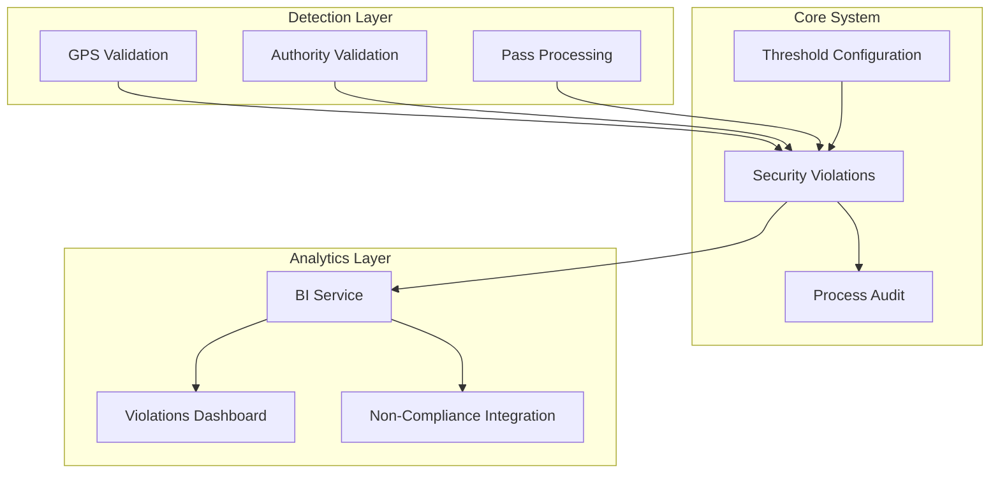

# Security Violations Management System - Design

## Overview

The Security Violations Management System provides a comprehensive solution for detecting, tracking, and analyzing security violations in the border control system. This design separates security incidents from operational audit logs, enabling dedicated violation management with configurable thresholds, investigation workflows, and business intelligence integration.

## Architecture

### High-Level Architecture



### System Components

1. **Threshold Configuration Service** - Manages configurable severity thresholds
2. **Violations Detection Engine** - Detects and creates violation records
3. **Violations Management Service** - CRUD operations for violations
4. **BI Integration Service** - Analytics and reporting
5. **Non-Compliance Integration** - Seamless integration with existing analytics

## Data Models

### Core Tables

#### 1. Security Violations Thresholds Configuration

```sql
CREATE TABLE security_violation_thresholds (
  id UUID PRIMARY KEY DEFAULT gen_random_uuid(),
  authority_id UUID NOT NULL REFERENCES authorities(id),
  violation_type TEXT NOT NULL, -- 'gps_distance', 'illegal_vehicle', 'expired_pass'
  
  -- Threshold configuration (JSONB for flexibility)
  thresholds JSONB NOT NULL DEFAULT '{}',
  -- Example for GPS: {"low_km": 20, "medium_km": 50, "high_km": 100}
  -- Example for illegal_vehicle: {"critical_days": 7, "high_days": 30, "medium_days": 90}
  -- Example for expired_pass: {"low_days": 7, "medium_days": 30, "high_days": 90}
  
  -- Audit trail
  created_at TIMESTAMP WITH TIME ZONE DEFAULT NOW(),
  updated_at TIMESTAMP WITH TIME ZONE DEFAULT NOW(),
  created_by UUID REFERENCES auth.users(id),
  updated_by UUID REFERENCES auth.users(id),
  
  -- Constraints
  UNIQUE(authority_id, violation_type)
);
```

#### 2. Security Violations

```sql
CREATE TABLE security_violations (
  id UUID PRIMARY KEY DEFAULT gen_random_uuid(),
  
  -- Core violation info
  violation_type TEXT NOT NULL, -- 'gps_distance_violation', 'illegal_vehicle_in_country', 'expired_pass_violation'
  severity_level TEXT NOT NULL, -- 'LOW', 'MEDIUM', 'HIGH', 'CRITICAL'
  status TEXT DEFAULT 'open', -- 'open', 'investigating', 'resolved', 'false_positive'
  
  -- Location data
  latitude DECIMAL(10, 8),
  longitude DECIMAL(11, 8),
  location_description TEXT,
  
  -- Who and when
  detected_by UUID REFERENCES auth.users(id),
  detected_at TIMESTAMP WITH TIME ZONE DEFAULT NOW(),
  authority_id UUID NOT NULL REFERENCES authorities(id),
  
  -- Related entities
  pass_id UUID REFERENCES purchased_passes(id),
  related_audit_id UUID REFERENCES pass_processing_audit(id),
  
  -- Flexible violation-specific data
  violation_data JSONB NOT NULL DEFAULT '{}',
  
  -- Investigation workflow
  investigated_by UUID REFERENCES auth.users(id),
  investigated_at TIMESTAMP WITH TIME ZONE,
  resolved_by UUID REFERENCES auth.users(id),
  resolved_at TIMESTAMP WITH TIME ZONE,
  resolution_notes TEXT,
  
  -- Audit trail
  created_at TIMESTAMP WITH TIME ZONE DEFAULT NOW(),
  updated_at TIMESTAMP WITH TIME ZONE DEFAULT NOW()
);

-- Indexes for performance
CREATE INDEX idx_security_violations_authority_type ON security_violations(authority_id, violation_type);
CREATE INDEX idx_security_violations_severity_status ON security_violations(severity_level, status);
CREATE INDEX idx_security_violations_detected_at ON security_violations(detected_at);
CREATE INDEX idx_security_violations_location ON security_violations(latitude, longitude);
CREATE INDEX idx_security_violations_pass_id ON security_violations(pass_id);
```

### Violation Data Structures

#### GPS Distance Violation
```json
{
  "border_id": "uuid",
  "border_name": "Ngwenya Border",
  "actual_distance_km": 45.2,
  "max_allowed_km": 30.0,
  "distance_over_limit_km": 15.2,
  "border_coordinates": {"lat": -26.1234, "lon": 31.5678},
  "official_coordinates": {"lat": -26.2000, "lon": 31.6000},
  "official_decision": "cancelled" // or "proceeded_with_override"
}
```

#### Illegal Vehicle Violation
```json
{
  "vehicle_description": "White Toyota Corolla",
  "vehicle_registration": "ABC123GP",
  "owner_name": "John Doe",
  "expected_status": "checked_out",
  "actual_status": "found_in_country",
  "last_checkout_date": "2024-01-15T10:30:00Z",
  "days_since_departure": 5,
  "scan_purpose": "routine_check",
  "scan_location": "Johannesburg CBD"
}
```

#### Expired Pass Violation
```json
{
  "pass_description": "7-Day Tourist Pass",
  "expiration_date": "2024-01-10T23:59:59Z",
  "days_overdue": 7,
  "attempted_action": "border_crossing",
  "border_name": "Main Border",
  "vehicle_description": "Blue BMW X5"
}
```

## Components and Interfaces

### 1. Threshold Configuration Service

```dart
class SecurityViolationThresholdsService {
  // Get thresholds for authority and violation type
  static Future<ViolationThresholds?> getThresholds(
    String authorityId, 
    String violationType
  );
  
  // Update thresholds with validation
  static Future<void> updateThresholds(
    String authorityId,
    String violationType,
    ViolationThresholds thresholds,
    String updatedBy
  );
  
  // Get default thresholds
  static ViolationThresholds getDefaultThresholds(String violationType);
  
  // Validate threshold configuration
  static bool validateThresholds(ViolationThresholds thresholds);
}

class ViolationThresholds {
  final String violationType;
  final Map<String, dynamic> thresholds;
  
  // Helper methods for specific violation types
  String calculateSeverity(Map<String, dynamic> violationData);
}
```

### 2. Violations Detection Service

```dart
class SecurityViolationsService {
  // Create new violation with automatic severity calculation
  static Future<String> createViolation({
    required String violationType,
    required String authorityId,
    required String detectedBy,
    String? passId,
    String? relatedAuditId,
    double? latitude,
    double? longitude,
    String? locationDescription,
    required Map<String, dynamic> violationData,
  });
  
  // Update violation status (for investigation workflow)
  static Future<void> updateViolationStatus(
    String violationId,
    String status,
    String updatedBy,
    String? notes
  );
  
  // Get violations with filtering
  static Future<List<SecurityViolation>> getViolations({
    String? authorityId,
    String? violationType,
    String? severityLevel,
    String? status,
    DateTime? startDate,
    DateTime? endDate,
    String? borderFilter,
  });
}
```

### 3. BI Integration Service

```dart
class SecurityViolationsBIService {
  // Get violation analytics for Non-Compliance screen
  static Future<Map<String, dynamic>> getViolationAnalytics(
    String authorityId, {
    String period = 'all_time',
    DateTime? customStartDate,
    DateTime? customEndDate,
    String borderFilter = 'any_border',
    String entryBorderFilter = 'any_entry',
    String exitBorderFilter = 'any_exit',
  });
  
  // Get violation counts by type and severity
  static Future<Map<String, int>> getViolationCounts(
    String authorityId,
    Map<String, dynamic> filters
  );
  
  // Get geographic violation distribution
  static Future<List<Map<String, dynamic>>> getViolationHeatMap(
    String authorityId,
    Map<String, dynamic> filters
  );
}
```

## Database Functions

### 1. Severity Calculation Function

```sql
CREATE OR REPLACE FUNCTION calculate_violation_severity(
  p_authority_id UUID,
  p_violation_type TEXT,
  p_violation_data JSONB
)
RETURNS TEXT
LANGUAGE plpgsql
AS $$
DECLARE
  v_thresholds JSONB;
  v_severity TEXT := 'MEDIUM'; -- Default fallback
BEGIN
  -- Get authority-specific thresholds
  SELECT thresholds INTO v_thresholds
  FROM security_violation_thresholds
  WHERE authority_id = p_authority_id 
  AND violation_type = p_violation_type;
  
  -- Use default thresholds if none configured
  IF v_thresholds IS NULL THEN
    CASE p_violation_type
      WHEN 'gps_distance' THEN
        v_thresholds := '{"low_km": 20, "medium_km": 50, "high_km": 100}';
      WHEN 'illegal_vehicle' THEN
        v_thresholds := '{"critical_days": 7, "high_days": 30, "medium_days": 90}';
      WHEN 'expired_pass' THEN
        v_thresholds := '{"low_days": 7, "medium_days": 30, "high_days": 90}';
    END CASE;
  END IF;
  
  -- Calculate severity based on violation type
  CASE p_violation_type
    WHEN 'gps_distance' THEN
      DECLARE
        v_distance_over DECIMAL := (p_violation_data->>'distance_over_limit_km')::DECIMAL;
      BEGIN
        IF v_distance_over >= (v_thresholds->>'high_km')::DECIMAL THEN
          v_severity := 'CRITICAL';
        ELSIF v_distance_over >= (v_thresholds->>'medium_km')::DECIMAL THEN
          v_severity := 'HIGH';
        ELSIF v_distance_over >= (v_thresholds->>'low_km')::DECIMAL THEN
          v_severity := 'MEDIUM';
        ELSE
          v_severity := 'LOW';
        END IF;
      END;
      
    WHEN 'illegal_vehicle' THEN
      DECLARE
        v_days_since DECIMAL := (p_violation_data->>'days_since_departure')::DECIMAL;
      BEGIN
        IF v_days_since <= (v_thresholds->>'critical_days')::DECIMAL THEN
          v_severity := 'CRITICAL';
        ELSIF v_days_since <= (v_thresholds->>'high_days')::DECIMAL THEN
          v_severity := 'HIGH';
        ELSIF v_days_since <= (v_thresholds->>'medium_days')::DECIMAL THEN
          v_severity := 'MEDIUM';
        ELSE
          v_severity := 'LOW';
        END IF;
      END;
      
    WHEN 'expired_pass' THEN
      DECLARE
        v_days_overdue DECIMAL := (p_violation_data->>'days_overdue')::DECIMAL;
      BEGIN
        IF v_days_overdue >= (v_thresholds->>'high_days')::DECIMAL THEN
          v_severity := 'CRITICAL';
        ELSIF v_days_overdue >= (v_thresholds->>'medium_days')::DECIMAL THEN
          v_severity := 'HIGH';
        ELSIF v_days_overdue >= (v_thresholds->>'low_days')::DECIMAL THEN
          v_severity := 'MEDIUM';
        ELSE
          v_severity := 'LOW';
        END IF;
      END;
  END CASE;
  
  RETURN v_severity;
END;
$$;
```

### 2. Violation Analytics Function

```sql
CREATE OR REPLACE FUNCTION get_violation_analytics(
  p_authority_id UUID,
  p_period TEXT DEFAULT 'all_time',
  p_start_date TIMESTAMP DEFAULT NULL,
  p_end_date TIMESTAMP DEFAULT NULL,
  p_border_filter TEXT DEFAULT 'any_border'
)
RETURNS TABLE (
  violation_type TEXT,
  severity_level TEXT,
  violation_count BIGINT,
  latest_violation TIMESTAMP WITH TIME ZONE
)
LANGUAGE plpgsql
AS $$
DECLARE
  v_date_filter TIMESTAMP WITH TIME ZONE;
BEGIN
  -- Calculate date filter
  CASE p_period
    WHEN 'last_7_days' THEN v_date_filter := NOW() - INTERVAL '7 days';
    WHEN 'last_30_days' THEN v_date_filter := NOW() - INTERVAL '30 days';
    WHEN 'custom_range' THEN v_date_filter := p_start_date;
    ELSE v_date_filter := NULL;
  END CASE;
  
  RETURN QUERY
  SELECT 
    sv.violation_type,
    sv.severity_level,
    COUNT(*)::BIGINT as violation_count,
    MAX(sv.detected_at) as latest_violation
  FROM security_violations sv
  WHERE sv.authority_id = p_authority_id
    AND (v_date_filter IS NULL OR sv.detected_at >= v_date_filter)
    AND (p_end_date IS NULL OR sv.detected_at <= p_end_date)
    AND (p_border_filter = 'any_border' OR 
         sv.violation_data->>'border_name' = p_border_filter OR
         sv.violation_data->>'border_id' = p_border_filter)
  GROUP BY sv.violation_type, sv.severity_level
  ORDER BY violation_count DESC;
END;
$$;
```

## Integration Points

### 1. GPS Validation Integration

Update existing GPS validation to create violations:

```dart
// In BorderSelectionService.validateBorderGpsDistance()
if (!validation.withinRange) {
  // Create security violation
  await SecurityViolationsService.createViolation(
    violationType: 'gps_distance_violation',
    authorityId: authorityId,
    detectedBy: currentUserId,
    passId: passId,
    latitude: currentLat,
    longitude: currentLon,
    locationDescription: validation.borderName,
    violationData: {
      'border_id': borderId,
      'border_name': validation.borderName,
      'actual_distance_km': validation.actualDistanceKm,
      'max_allowed_km': validation.maxAllowedKm,
      'distance_over_limit_km': validation.actualDistanceKm - validation.maxAllowedKm,
      'border_coordinates': {'lat': borderLat, 'lon': borderLon},
      'official_coordinates': {'lat': currentLat, 'lon': currentLon},
    },
  );
}
```

### 2. Authority Validation Integration

Update authority validation to detect illegal vehicles:

```dart
// In AuthorityValidationScreen._completeValidation()
if (pass.vehicleStatusDisplay == 'Departed') {
  // Create security violation
  await SecurityViolationsService.createViolation(
    violationType: 'illegal_vehicle_in_country',
    authorityId: widget.currentAuthorityId,
    detectedBy: currentUserId,
    passId: pass.passId,
    latitude: _currentLatitude,
    longitude: _currentLongitude,
    locationDescription: _getLocationDescription(),
    violationData: {
      'vehicle_description': pass.vehicleDescription,
      'vehicle_registration': pass.vehicleRegistrationNumber,
      'owner_name': ownerName,
      'expected_status': 'checked_out',
      'actual_status': 'found_in_country',
      'last_checkout_date': lastCheckoutDate?.toIso8601String(),
      'days_since_departure': daysSinceDeparture,
      'scan_purpose': _selectedScanPurpose,
      'scan_location': scanLocation,
    },
  );
}
```

### 3. Non-Compliance Screen Integration

Update existing Non-Compliance screen to include violations:

```dart
// Add to _buildNonComplianceCategories()
_buildClickableNonComplianceCard(
  'GPS Distance Violations',
  (_analyticsData['gpsViolations'] ?? 0).toString(),
  'Officials processing passes outside allowed GPS range',
  Icons.gps_off,
  Colors.red,
  () => _showViolationDetails('gps_distance_violation'),
),

_buildClickableNonComplianceCard(
  'Illegal Vehicles In-Country',
  (_analyticsData['illegalVehicles'] ?? 0).toString(),
  'Vehicles found in-country but showing as departed',
  Icons.warning,
  Colors.orange,
  () => _showViolationDetails('illegal_vehicle_in_country'),
),

_buildClickableNonComplianceCard(
  'Expired Pass Violations',
  (_analyticsData['expiredPassViolations'] ?? 0).toString(),
  'Attempts to use expired passes for border crossings',
  Icons.schedule,
  Colors.amber,
  () => _showViolationDetails('expired_pass_violation'),
),
```

## Error Handling

### Violation Detection Errors
- **Threshold Configuration Missing**: Use default thresholds and log warning
- **Invalid Violation Data**: Log error and create violation with MEDIUM severity
- **Database Connection Issues**: Queue violations for retry mechanism
- **GPS Coordinate Issues**: Create violation without location data

### BI Integration Errors
- **Analytics Query Failures**: Return empty results with error logging
- **Filter Validation Errors**: Apply default filters and notify user
- **Performance Issues**: Implement query timeouts and result caching

## Testing Strategy

### Unit Tests
- Threshold configuration validation
- Severity calculation logic
- Violation data serialization/deserialization
- BI analytics calculations

### Integration Tests
- GPS validation → violation creation flow
- Authority validation → violation creation flow
- Non-compliance screen → violation analytics flow
- Database function performance tests

### End-to-End Tests
- Complete violation lifecycle (detection → investigation → resolution)
- Multi-authority threshold configuration
- Filter combinations in BI analytics
- Performance under load with large violation datasets

## Performance Considerations

### Database Optimization
- Proper indexing on violation queries
- Partitioning by authority_id for large datasets
- Query result caching for BI analytics
- Batch processing for violation creation

### UI Performance
- Lazy loading for violation lists
- Pagination for large result sets
- Debounced filter updates
- Optimistic UI updates for status changes

### Scalability
- Horizontal scaling for violation detection
- Read replicas for BI analytics
- Background processing for heavy calculations
- Rate limiting for violation creation APIs

This design provides a robust, scalable foundation for the Security Violations Management System while maintaining seamless integration with existing Non-Compliance analytics and following established patterns in the codebase.